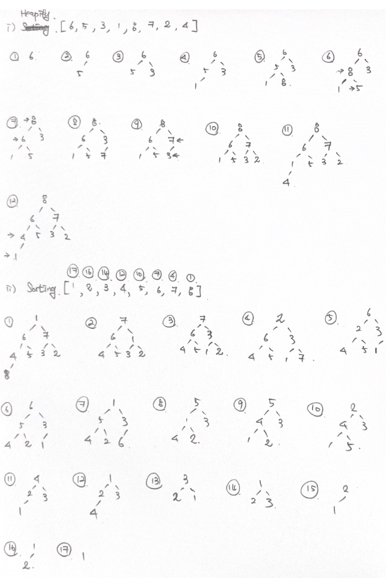
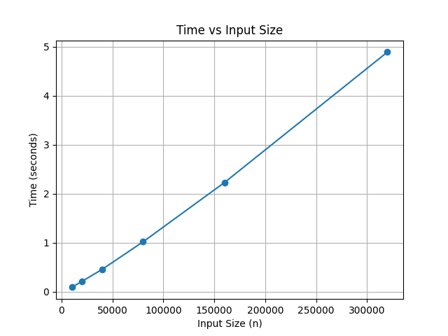
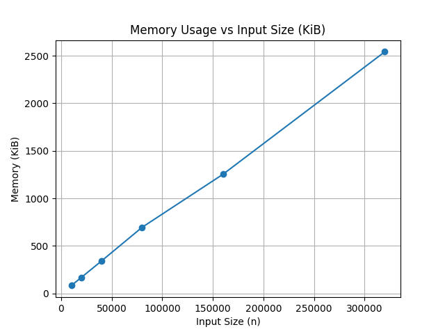

> 크래프톤 정글에서의 1주차를 마치는 Week-I-Learn [1]  
> 해당 글은 [Notion TIL & WIL DB](https://1intheworldhsryu.notion.site/Jungle-Dev-Paul-s-Study-DB-22d27535a87280edad52c965f5658b69?source=copy_link)에서도 확인하실 수 있습니다.

## 2025.07.12 ~ 13

#### 재귀 함수와 꼬리 재귀에 대하여
- 재귀 함수란
  - 자기 자신을 참조하는 함수를 의미
  - Base-Case 즉, `Return` 문이 꼭 있어야함
  - 함수를 호출할 때에는, 이전과 달라진 값을 넣어야 함
  - _👍 Pros_
    - 재사용성이 좋음 (모듈화 및 함수화가 가능)
    - 변수 사용이 줄어든다.
  - _👎 Cons_
    - 반복 작업이 늘어나면 메모리 관리가 불리
      - 일반적으로 Call-Stack이 쌓이며, 정해진 Stack의 용량을 초과할 경우 Stack-Overflow가 발생
    - 유지 보수에 있어 불리함
      - 재귀의 탈출 조건 설정은 까다로움
      - 협업을 하는 과정에 있어 `for`문에 비해 개발자에 따라 가독성이 떨어질 수 있음

<br/>
위는 일반적인 재귀 함수의 특징이다.  
그렇다면, Computer Memory 동작 구조에 대해 조금 알아보고 재귀 함수를 다시 알아보자.  
<br/>

> 🧑‍💻 Computer Memory에 대한 간단한 이해

- OS로부터 전달받는 메모리 공간은 크게 4개가 존재
  - `Code Space`
    - 실행할 프로그램의 코드가 저장되는 영역
    - 프로그램의 생명주기 동안 메모리에 계속 남아있음
    - 컴파일된 기계어(Machine Code)가 저장됨
    - CPU는 코드 영역에 저장된 명령어를 하나씩 가져가서 처리
  - `Data Space`
    - 프로그램의 전역 / 정적 변수 및 문자열 상수 저장
    - 프로그램이 시작하고 끝날 때까지 메모리에 계속 남아있음
  - `Stack Space`
    - 함수의 호출과 관계되는 지역변수 및 매개변수가 저장되는 영역
    - 함수의 호출과 함께 할당되며, 함수의 호출이 완료되면 소멸
      - 이러한 함수의 호출 정보를 `Stack Frame`이라고 부름
    - 프로그램이 자동을 사용하는 임시 메모리 영역
  - `Heap Space`
    - User가 직접 관리해야하는 영역
    - 사용자에 의해 메모리 공간이 동적으로 할당 / 해제
      - `malloc()/new`연산자를 통해 할당, `free()/delete`연산자를 통해 해제 가능
      - Runtime시에 크기 결정
- Heap Overflow vs Stack Overflow
  - `Heap Overflow` : Heap이 아래에서부터 주소값을 채워서 올라가다, Stack 영역을 침범할 때 발생
  - `Stack Overflow` : Stack영역이 Heap을 침범했을 때 발생
- Call Stack?
  - 함수의 호출과 함께 Stack이 할당되며, 함수의 호출이 완료되었을 때 소멸
  - 함수의 호출과 관계되는 지역 변수와 매개변수가 저장되는 영역
  - 정리하면,
    - `Call Stack` : 프로그램이 함수 호출을 추적할 때 사용하는 것
    - 함수의 Call당 하나씩의 Stack Block으로 이루어져 있음

_Example Code_
```
func roll_die() -> Int {
    return Int.random(in: 1...6)
}

func rollTwoAndSum() {
    var total = 0
        total = total + roll_die()
    
    print(total)
}

rollTwoAndSum()
```
_Code Review_
1. `rollTwoAndSum()` 호출
    > rollTwoAndSum()
2. `rollTwoAndSum()` -> `roll_die()` 호출
    > roll_die()  
    > rollTwoAndSum()
3. `roll_die()`에서 `Int.random(in:)` 호출
    > Int.random()  
    > roll_die()  
    > rollTwoAndSum()
4. `Int.random(in:)` 실행이 끝났을 때, Stack에서 제거, roll_die()에게 반환
    > roll_die()  
    > rollTwoAndSum()
5. `roll_die()`가 return
    > rollTwoAndSum()

<br/>
> 🧑‍💻 그렇다면, 재귀함수가 Stack Overflow가 나는 이유는?

- 재귀 함수의 특징
  - 자기 자신을 반복적으로 호출함
    - 일정한 조건을 만났을 때 탈출하는데,
      - 탈출보단, 자기 자신을 불렀던 **이전의 함수를 찾아서 돌아감**.
      - A -> A' -> A'' -> A'''(return) -> A'' -> A' -> A
    - 이때, `python`의 경우, Default로 호출할 수 있는 함수는 총 1000번

> The interpreter sets a maximum recursion depth in order to catch runaway recursion before filling the C stack and causing a core dump or GPF.. … _The default value is 1000_, and a rough maximum value for a given platform can be found by running a new script, `Misc/find_recursionlimit.py`.  

> [What's New in Python 2.0 참고](https://docs.python.org/3/whatsnew/2.0.html)


_Description_
- 언어별로 제한을 두는 이유는 당연히 Call Stack 초과로 인한 Stack Overflow를 방지하기 위함
- 이러한 이유에서 재귀함수는 잘 사용되지 않음
  - 무엇보다도 거의 같은 역할을 하는 `for` or `while`에 비해 그 사용성 및 cost가 월등히 떨어지기 때문

> 🧑‍💻 꼬리 재귀란?

- 꼬리 재귀는 재귀함수에서 기존에 호출된 함수의 정보를 지속적으로 저장하는 과정을 생략하기 위해 도입
  - 함수 안에서 함수의 호출이 발생할 때, 함수의 가장 마지막 순서에 위치하는 것을 말함
  - Pseudo Code로 확인하면,

_Example Code_
```
// 일반 재귀 함수
int factorial(int n) {
    if (n == 1) return 1;
        return n * factorial(n - 1);
}
```

```
// 꼬리 재귀 함수
int factorialTail(int n, int acc) {
    if(n == 1) return acc;
        return factorialTail(n - 1, acc * n);
}

int factorial(int n) {
    return factorialTail(n, 1);
}
```


_Code Review_
- 일반 재귀 함수는 재귀 호출 이후에, `n`을 곱하는 연산이 존재
- 반면 꼬리 재귀의 경우, `factorialTail` 이후에 연산이 존재하지 않음
  - 대신, `factorialTail` 안에서 `acc`를 `parameter`로 전달 받음
  - 이유는, `factorialTail` 함수가 실행이 됨과 동시에
  - 현재의 `n`값을 추적하여 `acc`에 곱해주고,
  - 최종적으로 `return acc;`를 통해 원하고자 하는 값 `1 * 5 * 4 * 3 * 2`를 반환하기 위함

> 🧑‍💻 꼬리 재귀를 정리하며

- 이러한 꼬리 재귀는, 겉으로 보기에는 재귀 함수와 같은 모습을 하지만,
  - 컴파일러의 시각에서는 반복문으로 실행이 되게 됨
- 일반적으로 꼬리 재귀는 2가지의 조건을 충족해야 정상적으로 실행이 가능함
  > 꼬리 재귀로 구현 할 것  
  > 컴파일러가 꼬리 재귀의 최적화를 지원해줄 것
  - 대표적으로 C++, C#, Kotlin, Swift는 꼬리 재귀의 최적화를 지원하지만,
  - Java, Python, Go는 지원하지 않음

<br/>
- 참고 자료
  - [재귀함수와 꼬리 재귀](https://velog.io/@dldhk97/%EC%9E%AC%EA%B7%80%ED%95%A8%EC%88%98%EC%99%80-%EA%BC%AC%EB%A6%AC-%EC%9E%AC%EA%B7%80)
  - [Memory 구조 (code, data, stack, heap)](https://velog.io/@xxhaileypark/Memory-%EA%B5%AC%EC%A1%B0-code-data-stack-heap)
  - [What's New in Python 2.0](https://docs.python.org/3/whatsnew/2.0.html)

#### Time Complexity & Space Complexity

- 시간 복잡도
  - 입력을 나타내는 문자열 길이의 함수로서 작동하는 알고리즘의 동작 시간을 정량화 하는 것이다. (출처 : [위키피디아](https://docs.python.org/3/whatsnew/2.0.html))
  - 최악 / 최선 / 평균의 시간 복잡도가 있는데 각각 표기법은 다음과 같다
    - Big-O Notation
      - 상한 점근 이라고도 표현
      - 일반적으로 최악의 경우를 표현하며, 가장 많이 쓰이는 표기법
        - 표기 방식은 최고차항을 제외한 나머지의 항과 상수를 제거하고, 최고차항의 계수도 제거하여 계산한다.
    - Big-Ω Notation
      - 하한 점근 이라고도 표현
      - 일반적으로 최선의 경우를 표현
    - Big-Θ Notation
      - 상한 점근과 하한 점근의 평균을 표현
      - 일반적으로 최악과 최선의 평균값
  - Terminology
    - 상수 시간 알고리즘 : `(Constant time algorithm)` T(n) = O(1)
    - 선형 시간 알고리즘 : `(Linear time algorithm)` T(n) = O(n)
    - log 시간 알고리즘 : `(Logarithmic time algorithm)` T(n) = O(logn)
    - 2차 시간 알고리즘 : `(Quadratic time algorithm)` T(n) = O(n^2)
    - 지수 시간 알고리즘 : `(Exponential time algorithm)` T(n) = O(2^n)
- 공간 복잡도
  - 입력의 특성에 따라 인스턴스를 해결하는 데 필요한 메모리 공간의 양이다 (출처 : [위키피디아](https://ko.wikipedia.org/wiki/%EA%B3%B5%EA%B0%84_%EB%B3%B5%EC%9E%A1%EB%8F%84))
  - 시간 복잡도와 마찬가지고 Big-O-Notation으로 계산된다.
  - 보통은 알고리즘이 완전하게 solved 되는데 필요한 메모리 공간이며, `Input Memory` + `실행 중에 사용되는 보조 Memory`까지 포함하여 계산된다.
- 시공간 복잡도의 추이 차트

$O(1) < O(logn) < O(n) < O(nlogn) < O(n^2) < O(2^n) < O(n!)$
- [시 / 공간 복잡도 계산기](https://github.com/IIIBreakeRIII/Time-Space-Complexity-Checker?tab=readme-ov-file)

## 2025.07.14

#### Sorting Algorithm

시작하기에 앞서, 본인이 정렬 알고리즘에 대한 공부가 처음이라면 다음의 페이지가 매우 좋은 길라잡이가 된다.
<div style="text-align: center;">
  <a href="https://visualgo.net/en" target="_blank">VisuAlgo</a>
</div>
알고리즘과 자료구조를 시각화하여 보여주는 페이지이다.  
필자도 해당 페이지로부터 도움을 많이 얻어 공유한다.

<br/>
> 🧑‍💻 Quick Sort란

- Charles Antony Richard Hoare가 개발한 범용 정렬 알고리즘
- 다른 원소와의 비교만으로 정렬을 수행하는 비교 정렬에 속함
- 문제를 더 작은 문제로 쪼개는 "분할 정복 알고리즘"
- 합병 정렬과 달리 추가 메모리 공간이 필요 없음
- 정렬된 배열일 경우 오히려 수행시간이 늘어날 수 있음

> 알고리즘

- 분할 : 먼저 pivot으로 사용할 원소 하나를 설정하고 pivot보다 작은 값은 left_list, 큰값은 right_list에 배치
  - e.g., `[3, 2, 5, 4, 1]` → `pivot = 3` → `left_list = [2, 1]` `pivot = [3]`, `right_list = [5, 4]`
- 정복 : 부분 배열을 정렬. 이때, 배열의 길이가 1이 될 때까지 재귀적으로 분할 과정을 호출
- 결합 : 정렬한 부분 배열을 하나로 합침. 이 때, 퀵 정렬을 제자리 정렬(In-place Algorithm)으로 구현하면 결합 단계 불필요

- _👍 Pros_
  - 추가적인 메모리를 거의 사용하지 않음
  - 매우 빠른 실행 속도 `O(nlogn)`
- _👎 Cons_
  - 최악의 경우 시간 복잡도는 `O(n^2)`까지 증가
  - 불안정 정렬임

_Code Example_
```python
def quick_sort(arr):

    if len(arr) < 2:
        return arr
    
    # pivot을 0번째 인덱스로 설정할 경우
    pivot = arr[0]
    left_list = []
    right_list = []

    for value in arr[1:]:
        if value < pivot:
            left_list.append(value)
        else:
            right_list.append(value)

    return quick_sort(left_list) + [pivot] + quick_sort(right_list)
```
- 시간 복잡도 및 공간 복잡도
  - 시간 복잡도의 경우,
    - 평균 : `O(nlogn)`
    - 최악 : `O(n^2)`
<div>
    
</div>
  - 공간 복잡도의 경우
    - 제자리 정렬을 사용 시 : `O(1)`
    - 일반 구현 시 : `O(n)`
<div>
    
</div>

<br/>
> 🧑‍💻 퀵 정렬이 빠른 이유?

위키피디아에 따르면,

> 퀵 정렬의 내부 루프는 대부분의 컴퓨터 아키텍처에서 효율적으로 작동하도록 설계되어 있고(그 이유는 메모리 참조가 지역화(locality)되어 있기 때문에 CPU 캐시의 히트율이 높아지기 때문이다.),  
대부분의 실질적인 데이터를 정렬할 때 제곱 시간이 걸릴 확률이 거의 없도록 알고리즘을 설계하는 것이 가능하다.

- 메모리 참조의 지역성
  - 컴퓨터는 프로그램을 실행할 때, 메모리를 일정한 패턴으로 접근 -> `지역성`
    - 시간적 지역성 : 최근에 접근한 데이터는 가까운 미래에도 다시 접근할 가능성이 큼
    - 공간적 지역성 : 어떤 메모리 주소가 접근되면, 그 주변 주소들도 곧 접근될 가능성이 큼
  - 지역성 특성을 기반으로 CPU 캐시라는 임시 저장소를 사용하게 되는데...
- 퀵정렬과 메모리 지역성
  - 퀵 정렬 알고리즘을 자세히 살펴보면
    - 피벗으로 선택하여 작은 값, 큰 값을 양쪽으로 분할하는 과정을 재귀적으로 반복
- 이 때 주목할 점은,
  - 퀵 정렬은 배열 내에서 대부분의 작업을 연속된 인접 메모리 공간에서 수행하게 됨
  - e.g., [1, 5, 9, 3, 7] -> 작은 범위로 나누며 반복해서 정렬
    - 이 작은 범위들은 메모리 상에 연속적으로 존재
    - 메모리 범위를 순차적으로 접근하고, 이는 캐시 라인에 이미 적재되어 있을 가능성이 높음
    - 때문에, 캐시에서 Hit Rate가 높아지는 결론에 도달
- 퀵 정렬이 빠른 이유는 결론적으로,
  - 연속된 메모리 접근 : 인접한 메모리 공간을 반복해서 참조 -> 공간 지역성 👍
  - 작은 서브 배열 처리 : 재귀 호출을 통해 더 작은 범위를 다루므로 캐시에 충분히 적재될 수 있음 -> 캐시 Hit Rate 👍

- 참고 자료
  - [퀵 정렬](https://ko.wikipedia.org/wiki/%ED%80%B5_%EC%A0%95%EB%A0%AC)
  - [13-05. 퀵 정렬 #1](https://wikidocs.net/219271)

<br />
> Heap Sort란

- 최대 힙 트리나 최소 힙 트리를 구성하여 정렬을 하는 방법
- 선택 정렬을 개선한 정렬 방식 중 하나로, 완전 이진 트리를 이용한 `Max Heap` or `Min Heap` 트리 구조를 활용하여 배열을 정렬
  - 모든 부모 노드가 자신의 자식 노드보다 큰 값(또는 작은 값)을 갖는 특성
- 알고리즘
  - n개의 노드에 대한 완전 이진 트리를 구성
    - 순서는 루트 노드 -> 부모 노드 -> 왼쪽 자식 노드 -> 오른쪽 자식 노드
  - 최대 힙(부모 노드 -> 자식 노드 인 트리)을 구성
  - 큰 수를 가진 노드와 작은 수를 가진 노드를 서로 교환
- 구성(`Max Heap` 기준)

- `Heapify`의 조건
  - 부모 노드보다 자식 노드가 작은 값을 갖고 있어야 함
  - 새로운 자식 노드는 항상 왼쪽에서 오른쪽으로 삽입
  - 하나의 `Level`이 끝나야 그 다음 `Level`을 생성
- `Sorting`의 조건
  - 최하위 자식 노드가 2개라면, 우측 노드와 루트 노드를 교환
  - `Max`노드가 `pop()`된 이후, 루트 노드는 그 다음 `Max`노드와 교환
  - 여기서 지킬 공식은, _언제나 부모 노드는 자식 노드보다 커야함_
- _👍 Pros_
  - 시간 복잡도 : 모든 경우에서 `O(nlogn)`을 보장 → 데이터 양이 많아도 성능이 급격히 떨어지지 않음
  - 공간 효율성 : 추가적인 메모리를 거의 사용하지 않고, `In-Place Algo` 방식을 사용
  - 최악의 경우에도 안정적임
- _👎 Cons_
  - 구현 복잡성 : 상대적으로 단순한 알고리즘이지만 그 구현이 어려운 편.
  - 불안정 정렬 : 같은 값의 요소가 초기의 순서를 유지하지 않을 수 있음
  - 같은 `O(nlogn)`에 비해 느림 : 퀵 정렬이 평균적인 경우 속도를 더 보장함

_Code Example_
```python
def heapify(arr, n, i):
    largest = i  # 루트를 최대값으로 가정
    l = 2 * i + 1  # 왼쪽 자식
    r = 2 * i + 2  # 오른쪽 자식

    # 왼쪽 자식이 루트보다 크다면
    if l < n and arr[l] > arr[largest]:
        largest = l

    # 오른쪽 자식이 현재 최대값보다 크다면
    if r < n and arr[r] > arr[largest]:
        largest = r

    # 최대값이 루트가 아니라면
    if largest != i:
        arr[i], arr[largest] = arr[largest], arr[i]  # 교환

        # 교환된 루트에 대해 다시 힙 구성
        heapify(arr, n, largest)

def heapSort(arr):
    n = len(arr)

    # 초기 최대 힙 구성
    for i in range(n // 2 - 1, -1, -1):
        heapify(arr, n, i)

    # 하나씩 원소를 꺼내어 다시 최대 힙 구성
    for i in range(n-1, 0, -1):
        arr[i], arr[0] = arr[0], arr[i]  # 루트와 마지막 요소 교환
        heapify(arr, i, 0)
```

시간 복잡도 및 공간 복잡도
- 시간 복잡도
  - 평균 / 최악 모두 `O(nlogn)`
  
- 공간 복잡도
  - `O(1)`
    - 추가 배열을 사용하지 않고, 주어진 배열 내에서 정렬 수행
  

- 참고 자료
  - [힙 정렬](https://ko.wikipedia.org/wiki/%ED%9E%99_%EC%A0%95%EB%A0%AC)
  - [5-04. Sort : Heap Sort](https://wikidocs.net/233712)

<br />
> Counting Sort란

- 비교를 하지 않는 정렬
- 주어진 배열 내에서 각 요소가 몇 번 등장했는지 counting하여 정렬하는 방법
- 즉, 특정 범위 내에 값을 가지는 데이터에 대해 매우 효율적으로 작동
- 조건
  - 입력 배열의 요소가 정해져 있어야함
    - e.g., 1 ~ 10,000 or max: 10,000
  - 입력 데이터가 정수여야 함
- _👍 Pros_
  - 정렬 안정성이 좋음
  - 정렬 속도가 빠름
    - 시간 복잡도는 `O(n)`
- _👎 Cons_
  - 한정적인 메모리 사용량
    - 입력 데이터의 최대 데이터값이 클 수록, 메모리 사용량이 많아지는 구조
  - 제한된 데이터 유형
    - 정수와 같은 특정한 유형의 데이터만 표현이 가능
- 알고리즘
  - 입력 배열의 요소 범위 확인
  - 카운트 배열 초기화 및 데이터 count
    - `[0] * input_count`
    - `[0, 2, 1, 4, 1]` -> `output` : `1, 2, 1, 0, 1`

_Code Example_
```python
# BOJ No.10989 수 정렬하기 3

num = int(input())
# num_list라는 입력 조건의 자연수 만큼 배열 생성
num_list = [0] * 10001

# 현재 들어오는 숫자의 index로 가서 count += 1
# 2일 경우, num_list[2] += 1
for _ in range(num):
    n = int(input())
    num_list[n] += 1

# 0부터 10,000까지 저장되어 있는 수의 개수 만큼 그 index 출력
# num_list[2] = 2 일 경우, 2\n 2 출력
for i in range(10001):
    if num_list[i] != 0:
        for j in range(num_list[i]):
            print(i)

# TestCase
# Input: 10 5\n 2\n 3\n 1\n 4\n 2\n 3\n 5\n 1\n 7
# Output: 1\n 1\n 2\n 3\n 3\n 4\n 5\n 5\n 7

# Input 조건
# num = 개수 (1 ~ 10,000,000)
# num_list = (1 ~ 10,000)의 자연수 num개
```
- 참고 자료
  - [5-08. Sort : Count Sort](https://wikidocs.net/233715)

<br />
> Radix Sort란

- 기수 별로 비교 없이 수행하는 정렬 알고리즘
- 기수에 따라 원소를 버킷에 넣는 방식으로 비교 연산이 불필요함
- 알고리즘
  - 기수 정렬은 최상위 유효 숫자(Most Significant Digit)나 최하위 유효 숫자(Least Significant Digit)에서 시작하도록 구현할 수 있음
    - e.g., 1234 -> MSD(1) or LSD(4)
  - `LSD` 기수 정렬의 경우 짧은 키가 긴 키보다 먼저 나오고, 같은 길이의 경우 사전순으로 정렬
    - [1, 2, 3, 4, 5, 6, 7, 8, 9, 10]와 같은 정수 표현의 일반적인 순서와 일치
    - 때문에 안정 정렬에 속함
  - `MSD` 기수 정렬의 경우 문자열이나 고정 길이 정수 표현 정렬에 적합
    - [b, c, d, e, f, ba] -> [b, ba, c, d, e, f]로 정렬
    - 사전식 순서로 10진법의 경우 [1, 10, 2, 3, 4, 5, 6, 7, 8 ,9] 로 정렬
    - 특정 구현 방식에서는 중복 키의 원래 순서를 항상 유지하지 않아 불안정 정렬에 속함
- 정렬 방법
```
170, 45, 75, 90, 2, 24, 802, 66

// 1의 자리만 보고 수행
170, 90, 2, 802, 24, 45, 75, 66

// 10의 자리만 보고 수행
2, 802, 24, 45, 66, 170, 75, 90

// 100의 자리만 보고 수행
2, 24, 45, 66, 75, 90, 170, 802
```

_Code Example_
```Python
def countingSort(arr, digit):
    n = len(arr)
  
    output = [0] * (n)
    count = [0] * (10)
    
    for i in range(0, n):
        index = int(arr[i] / digit) 
        count[(index) % 10] += 1
 
    for i in range(1, 10):
        count[i] += count[i - 1]  
        print(i, count[i])
    
    i = n - 1

    while i >= 0:
        index = int(arr[i] / digit)
        output[count[(index) % 10 ] - 1] = arr[i]
        count[(index) % 10 ] -= 1
        i -= 1

    for i in range(0, len(arr)): 
        arr[i] = output[i]
 
def radixSort(arr):

    maxValue = max(arr)

    digit = 1

    while int(maxValue / digit) > 0: 
        countingSort(arr, digit)
        digit *= 10
 
arr = [170, 45, 75, 90, 802, 24, 2, 66]

radixSort(arr)
```

- 시간 복잡도 및 공간 복잡도
  - 시간 복잡도의 경우, `O(nw)`
    - n은 키의 수, w는 키의 길이
    - 키의 길이 즉, 자릿수에 영향을 많이 받게 됨
    
  - 공간 복잡도의 경우, `O(k + n)`
    - 여기서 k = 기수의 도메인 크기
  - 적당한 도메인에서 최적화된 기수 정렬은 매우 빠를 수 있지만, 그만큼 제약도 많음
